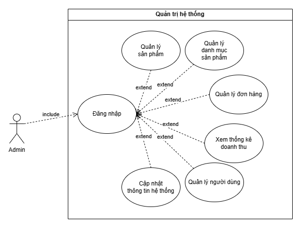
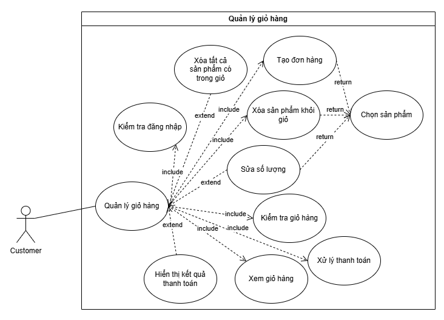
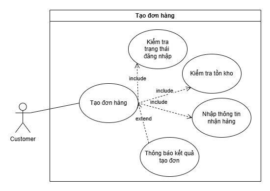
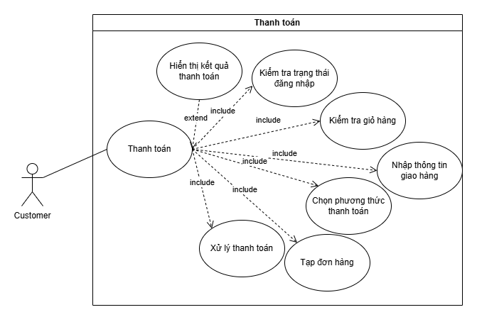
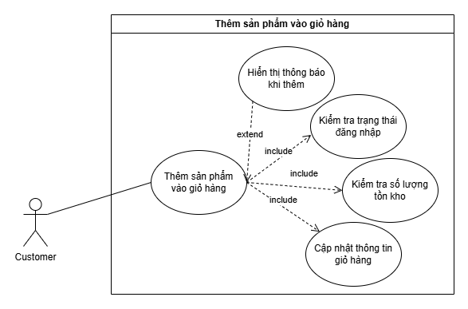
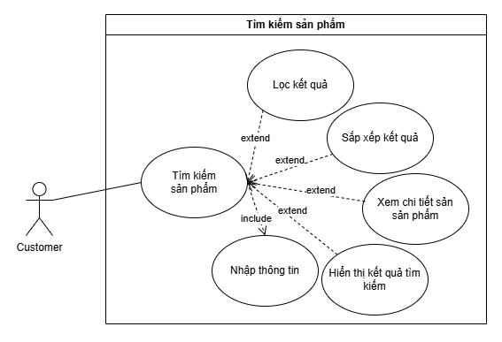
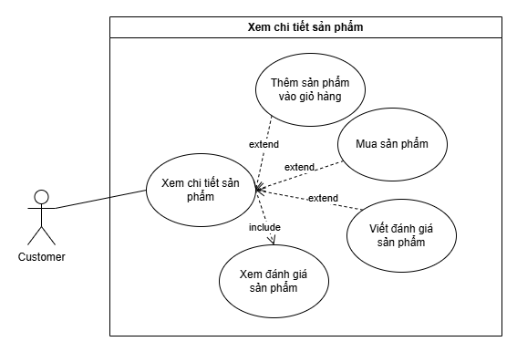
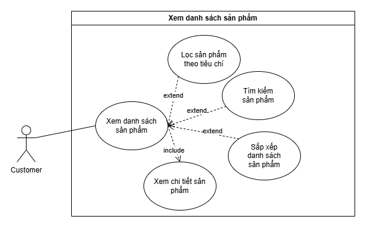
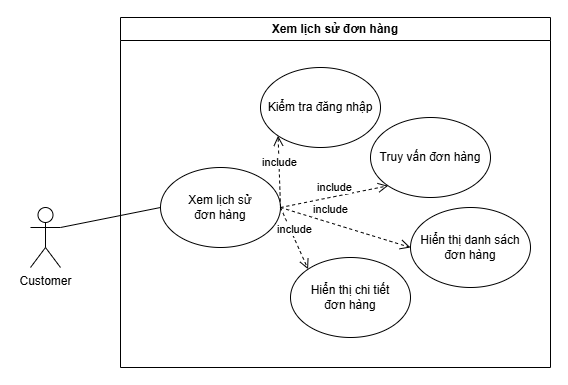

# 💻 TECHMART – Hệ thống thương mại điện tử chuyên ngành công nghệ

📖 **Môn học:** Kỹ thuật Phần mềm

🌐 **Tên dự án:** `TechMart` – Hệ thống thương mại điện tử chuyên ngành công nghệ

👨‍💻 **Nhóm thực hiện:** Nhóm [4] – Lớp [Kĩ thuật phần mềm - N06]

### 👥 **Danh sách thành viên**

| 🆔 **STT** | 👤 **Họ và Tên**  | 📧 **Email** |
|:-:|:-----------------------|:--------------------------------------------------------------------------|
| 1 | **Lê Mạnh Hùng**       | [23010123@st.phenikaa-uni.edu.vn](mailto:23010123@st.phenikaa-uni.edu.vn) |
| 2 | **Lê Quốc Trình**      | [23010149@st.phenikaa-uni.edu.vn](mailto:23010149@st.phenikaa-uni.edu.vn) |
| 3 | **Nguyễn Văn Mạnh**    | [23010599@st.phenikaa-uni.edu.vn](mailto:23010599@st.phenikaa-uni.edu.vn) |
| 4 | **Nguyễn Kiêm Mạnh**   | [23010909@st.phenikaa-uni.edu.vn](mailto:23010909@st.phenikaa-uni.edu.vn) |

# 📝 KẾ HOẠCH DỰ ÁN – TECHMART

## 1. 🎯 Mục tiêu dự án

- **Xây dựng một hệ thống thương mại điện tử cho phép người dùng:**

	- *Xem và tìm kiếm các sản phẩm công nghệ.*
	- *Thêm sản phẩm vào giỏ hàng, thanh toán đơn hàng.*
	- *Quản lý tài khoản cá nhân (đăng ký, đăng nhập).*
   
- **Cho phép quản trị viên:**
  
	- *Quản lý danh mục sản phẩm, đơn hàng và người dùng.*
  	- *Hướng đến một giao diện thân thiện, hiện đại và dễ sử dụng.*

## 2. 📦 Phạm vi dự án
### Chức năng chính:
- ✅ **Người dùng:**

	- *Đăng ký, đăng nhập.*
	- *Tìm kiếm, lọc và xem chi tiết sản phẩm.*
	- *Thêm sản phẩm vào giỏ hàng, đặt hàng, thanh toán.*
	- *Xem lịch sử mua hàng.*

- ✅ **Quản trị viên:**

	- *Thêm/xóa/sửa sản phẩm.*
	- *Quản lý danh mục sản phẩm.*
	- *Xem đơn hàng và trạng thái thanh toán.*
	- *Quản lý tài khoản người dùng.*

### Công nghệ sử dụng:

- ***Frontend:** 🌐`HTML`, 🎨`CSS`, ⚙️`JavaScript`, 💠`Bootstrap`.*
- ***Backend:** 🐘🔴`PHP/Laravel`.*
- ***Cơ sở dữ liệu:** 🐬`MySQL`.*
- ***Công cụ quản lý mã nguồn:** 🐙`GitHub`.*

## 3. 🗓️ Tiến độ dự án (Dự kiến)
## 4. 👨‍💻 Phân công công việc
## 5. 🧪 Chiến lược kiểm thử

- Kiểm thử đơn vị (Unit test): Kiểm tra các chức năng nhỏ riêng biệt.
- Kiểm thử tích hợp (Integration test): Kiểm tra tương tác giữa các module.
- Kiểm thử hệ thống (System test): Kiểm tra toàn bộ hệ thống.
- Kiểm thử chấp nhận (User Acceptance Test): Kiểm tra theo tình huống người dùng.

# 📄 SRS (Software Requirements Specification) – Phân tích yêu cầu và đặc tả

## 1. 💡 Giới thiệu
### 1.1 Mục đích
Tài liệu này mô tả chi tiết các yêu cầu chức năng và phi chức năng của hệ thống TechMart – một website thương mại điện tử chuyên bán các sản phẩm công nghệ như laptop, điện thoại, phụ kiện,... Mục tiêu là xây dựng hệ thống hỗ trợ mua bán trực tuyến, quản lý sản phẩm và đơn hàng hiệu quả.

### 1.2 Phạm vi hệ thống
Người dùng có thể xem sản phẩm, tìm kiếm, đặt hàng, thanh toán và theo dõi đơn hàng.

Quản trị viên có thể thêm, sửa, xóa sản phẩm và quản lý đơn hàng.

Hệ thống bao gồm các chức năng: đăng ký, đăng nhập, giỏ hàng, đặt hàng, thống kê.

### 1.3 Đối tượng đọc
Giảng viên/giáo vụ

Các thành viên trong nhóm phát triển

Bên kiểm thử (tester)

### 1.4 Phạm vi sản phẩm
Hệ thống sẽ được triển khai dưới dạng một web app. Giao diện trực quan, dễ dùng, tương thích với các trình duyệt phổ biến.

## 2. 📚 Mô tả tổng quan
### 2.1 Giả định và phụ thuộc
Người dùng có kết nối internet và sử dụng trình duyệt hiện đại.

Dữ liệu sẽ được lưu trữ bằng MySQL.

Hệ thống chỉ hoạt động với tài khoản đã đăng ký.

### 2.2 Hạn chế
Hệ thống không hỗ trợ thanh toán online thực tế (mô phỏng).

Không hỗ trợ phiên bản di động (mobile app).

## 3. 🧩 Chức năng hệ thống
### 3.1 Đối với Người dùng
#### UC01 – Đăng ký tài khoản
Nhập thông tin cá nhân: tên, email, mật khẩu.

Kiểm tra tính hợp lệ và lưu thông tin vào hệ thống.

#### UC02 – Đăng nhập / Đăng xuất
Cho phép người dùng truy cập bằng tài khoản đã đăng ký.

#### UC03 – Tìm kiếm & xem sản phẩm
Tìm kiếm theo tên, loại, mức giá.

Xem chi tiết sản phẩm (mô tả, hình ảnh, giá, đánh giá).

#### UC04 – Quản lý giỏ hàng
Thêm, sửa, xóa sản phẩm trong giỏ.

Tính tổng tiền tự động.

#### UC05 – Đặt hàng
Xác nhận đơn hàng từ giỏ hàng.

Lưu đơn hàng vào hệ thống.

#### UC06 – Xem lịch sử đơn hàng
Người dùng có thể xem lại các đơn hàng đã đặt.

### 3.2 Đối với Quản trị viên
#### UC07 – Quản lý sản phẩm
Thêm/sửa/xoá sản phẩm.

Nhập thông tin: tên, mô tả, giá, hình ảnh, số lượng, loại sản phẩm.

#### UC08 – Quản lý danh mục
Thêm/sửa/xoá các loại sản phẩm (laptop, điện thoại...).

#### UC09 – Quản lý người dùng
Xem danh sách người dùng, khoá/mở tài khoản.

#### UC10 – Quản lý đơn hàng
Xem danh sách đơn hàng.

Cập nhật trạng thái đơn hàng (chờ xác nhận, đã giao...).

## 4. 🧪 Yêu cầu phi chức năng

| Tên yêu cầu          | Mô tả                                                                                          |
| -------------------- | ---------------------------------------------------------------------------------------------- |
| Bảo mật              | Mật khẩu được mã hóa trước khi lưu trữ. Chỉ người có quyền mới được truy cập khu vực quản trị. |
| Hiệu năng            | Hệ thống xử lý tìm kiếm và đặt hàng trong vòng < 3 giây.                                       |
| Khả năng mở rộng     | Có thể mở rộng để thêm tính năng thanh toán online, đánh giá sản phẩm.                         |
| Giao diện người dùng | Giao diện thân thiện, dễ sử dụng cho người không chuyên.                                       |
| Tương thích          | Hoạt động tốt trên Chrome, Firefox, Edge.                                                      |

## 5. 🧠 Mô hình và sơ đồ (tóm tắt)

### Mô hình ERD

### Mô hình quan hệ

### Sơ đồ Use Case
#### Use case tổng quát
##### Admin

##### Customer

#### Chi tiết use case sử dụng
##### Admin
###### Use case quản lý danh mục

###### Use case quản lý đơn hàng

###### Use case quản lý người dùng

###### Use case quản lý sản phẩm

###### Use case thống kê doanh thu

##### Customer
###### Use case quản lý giỏ hàng

###### Use case tạo đơn hàng

###### Use case thanh toán

###### Use case thêm sản phẩm vào giỏ hàng

###### Use case tìm kiếm sản phẩm

###### Use case xem chi tiết sản phẩm

###### Use case xem danh sách sản phẩm

###### Use case xem lịch sử đơn hàng

### Biểu đồ tuần tự các chức năng cơ bản
#### Biểu đồ tuần tự chức năng đăng nhập

#### Biểu đồ tuần tự chức năng đăng kí

#### Biểu đồ tuần tự chức năng đặt hàng

#### Biểu đồ tuần tự chức năng duyệt đơn hàng

#### Biểu đồ tuần tự chức năng thanh toán

#### Biểu đồ tuần tự chức năng tìm kiếm

### Sơ đồ hoạt động các chức năng cơ bản
#### Biểu đồ hoạt động chức năng đăng nhập

#### Biểu đồ hoạt động chức năng đăng kí

#### Biểu đồ hoạt động chức năng quản lý đơn hàng(Admin)

#### Biểu đồ hoạt động chức năng thanh toán

#### Biểu đồ hoạt động chức năng thêm sản phẩm vào giỏ hàng

#### Biểu đồ hoạt động chức năng tìm kiếm và xem chi tiết sản phẩm

# 🏗️ THIẾT KẾ CHƯƠNG TRÌNH

## 1. Kiến trúc hệ thống (Architecture)
### 1.1 Mô hình kiến trúc: MVC (Model – View – Controller)
Model: Xử lý dữ liệu và tương tác với CSDL (MySQL).

View: Giao diện người dùng (HTML, CSS, JavaScript).

Controller: Xử lý logic, điều hướng yêu cầu giữa Model và View (Laravel/PHP hoặc bất kỳ framework nào nhóm chọn).

### 1.2 Mô hình triển khai (Deployment)
Client (browser): Truy cập giao diện website.

Web Server (Laravel/PHP): Xử lý logic và điều phối request.

Database Server (MySQL): Lưu trữ dữ liệu sản phẩm, người dùng, đơn hàng, v.v.

## 2. Thiết kế chức năng
### 2.1 Chức năng Người dùng

| STT | Tên chức năng         | Mô tả                                                           |
| :-: | --------------------- | --------------------------------------------------------------- |
| 1   | Đăng ký/Đăng nhập     | Cho phép người dùng tạo tài khoản và đăng nhập                  |
| 2   | Xem sản phẩm          | Hiển thị danh sách sản phẩm theo danh mục hoặc từ khóa tìm kiếm |
| 3   | Xem chi tiết sản phẩm | Hiển thị thông tin chi tiết sản phẩm đã chọn                    |
| 4   | Thêm vào giỏ hàng     | Lưu sản phẩm vào giỏ hàng của người dùng                        |
| 5   | Thanh toán/Đặt hàng   | Tạo đơn hàng mới từ các sản phẩm trong giỏ hàng                 |
| 6   | Xem lịch sử đơn hàng  | Người dùng có thể xem lại các đơn hàng đã mua                   |

### 2.2 Chức năng Quản trị viên

| STT | Tên chức năng        | Mô tả                                                      |
| :-: | -------------------- | ---------------------------------------------------------- |
| 1   | Quản lý sản phẩm     | Thêm, sửa, xóa sản phẩm (tên, giá, ảnh, mô tả, tồn kho...) |
| 2   | Quản lý danh mục     | Thêm, sửa, xóa danh mục sản phẩm                           |
| 3   | Quản lý đơn hàng     | Xem danh sách đơn hàng, cập nhật trạng thái đơn hàng       |
| 4   | Quản lý người dùng   | Quản lý tài khoản người dùng, khóa hoặc cấp quyền (nếu có) |
| 5   | Xem báo cáo thống kê | Thống kê doanh thu, đơn hàng theo ngày/tháng               |

## 3. Thiết kế dữ liệu và CSDL
### 3.1 Mô hình ERD (Entity Relationship Diagram) – Tóm tắt các bảng chính:

| Tên bảng         | Mô tả                                                            |
| ---------------- | ---------------------------------------------------------------- |
| **users**        | Lưu thông tin người dùng (tên, email, mật khẩu, vai trò...)      |
| **products**     | Lưu thông tin sản phẩm (tên, mô tả, giá, hình ảnh, tồn kho...)   |
| **categories**   | Lưu danh mục sản phẩm (tên, mô tả)                               |
| **orders**       | Lưu thông tin đơn hàng (user\_id, thời gian đặt, tổng tiền...)   |
| **order\_items** | Chi tiết đơn hàng: mỗi dòng là 1 sản phẩm trong đơn hàng         |
| **cart\_items**  | Sản phẩm người dùng đã thêm vào giỏ hàng |
| **product\_variants**  | Phiên bản sản phẩm |

### 3.2 Chi tiết các bảng

#### Bảng `users`

| Tên cột        | Kiểu dữ liệu              | Ràng buộc                    | Mô tả              |
| -------------- | ------------------------- | ---------------------------- | ------------------ |
| user\_id       | INT                       | PRIMARY KEY, AUTO\_INCREMENT | ID người dùng      |
| name           | VARCHAR(100)              | NOT NULL                     | Tên người dùng     |
| email          | VARCHAR(100)              | UNIQUE                       | Email (duy nhất)   |
| password\_hash | VARCHAR(255)              | NOT NULL                     | Mật khẩu đã mã hóa |
| phone          | VARCHAR(20)               |                              | Số điện thoại      |
| address        | TEXT                      |                              | Địa chỉ người dùng |
| role           | ENUM('customer', 'admin') | DEFAULT 'customer'           | Vai trò người dùng |
| created\_at    | DATETIME                  | DEFAULT CURRENT\_TIMESTAMP   | Ngày tạo tài khoản |

#### Bảng `products`
| Tên cột         | Kiểu dữ liệu  | Ràng buộc                              | Mô tả                  |
| --------------- | ------------- | -------------------------------------- | ---------------------- |
| product\_id     | INT           | PRIMARY KEY, AUTO\_INCREMENT           | ID sản phẩm            |
| name            | VARCHAR(255)  | NOT NULL                               | Tên sản phẩm           |
| description     | TEXT          |                                        | Mô tả sản phẩm         |
| price           | DECIMAL(10,2) | NOT NULL                               | Giá cơ bản sản phẩm    |
| stock\_quantity | INT           |                                        | Số lượng tồn kho       |
| category\_id    | INT           | FOREIGN KEY -> categories.category\_id | ID danh mục sản phẩm   |
| image\_url      | TEXT          |                                        | Link hình ảnh sản phẩm |
| created\_at     | DATETIME      | DEFAULT CURRENT\_TIMESTAMP             | Ngày tạo sản phẩm      |

#### Bảng `categories`
| Tên cột        | Kiểu dữ liệu | Ràng buộc                    | Mô tả                   |
| -------------- | ------------ | ---------------------------- | ----------------------- |
| category\_id   | INT          | PRIMARY KEY, AUTO\_INCREMENT | ID danh mục             |
| category\_name | VARCHAR(100) | UNIQUE                       | Tên danh mục (duy nhất) |

#### Bảng `orders`
| Tên cột           | Kiểu dữ liệu                                                       | Ràng buộc                     | Mô tả               |
| ----------------- | ------------------------------------------------------------------ | ----------------------------- | ------------------- |
| order\_id         | INT                                                                | PRIMARY KEY, AUTO\_INCREMENT  | ID đơn hàng         |
| user\_id          | INT                                                                | FOREIGN KEY -> users.user\_id | Người đặt hàng      |
| order\_date       | DATETIME                                                           | DEFAULT CURRENT\_TIMESTAMP    | Ngày đặt hàng       |
| total\_amount     | DECIMAL(10,2)                                                      | NOT NULL                      | Tổng tiền           |
| status            | ENUM('pending', 'processing', 'shipped', 'delivered', 'cancelled') | DEFAULT 'pending'             | Trạng thái đơn hàng |
| shipping\_address | TEXT                                                               | NOT NULL                      | Địa chỉ giao hàng   |

#### Bảng `order_items`
| Tên cột         | Kiểu dữ liệu  | Ràng buộc                                    | Mô tả                 |
| --------------- | ------------- | -------------------------------------------- | --------------------- |
| order\_item\_id | INT           | PRIMARY KEY, AUTO\_INCREMENT                 | ID chi tiết đơn hàng  |
| order\_id       | INT           | FOREIGN KEY -> orders.order\_id              | Đơn hàng liên kết     |
| variant\_id     | INT           | FOREIGN KEY -> product\_variants.variant\_id | Biến thể sản phẩm     |
| quantity        | INT           | NOT NULL                                     | Số lượng mua          |
| price           | DECIMAL(10,2) | NOT NULL                                     | Giá tại thời điểm mua |

#### Bảng `product_variants`
| Tên cột           | Kiểu dữ liệu  | Ràng buộc                           | Mô tả                              |
| ----------------- | ------------- | ----------------------------------- | ---------------------------------- |
| variant\_id       | INT           | PRIMARY KEY, AUTO\_INCREMENT        | ID biến thể                        |
| product\_id       | INT           | FOREIGN KEY -> products.product\_id | Sản phẩm liên kết                  |
| variant\_name     | VARCHAR(100)  | NOT NULL                            | Tên biến thể (VD: "8GB RAM - Đen") |
| additional\_price | DECIMAL(10,2) |                                     | Giá cộng thêm của biến thể         |
| stock\_quantity   | INT           |                                     | Số lượng tồn kho của biến thể      |

#### Bảng `cart_items`
| Tên cột        | Kiểu dữ liệu | Ràng buộc                                    | Mô tả                      |
| -------------- | ------------ | -------------------------------------------- | -------------------------- |
| cart\_item\_id | INT          | PRIMARY KEY, AUTO\_INCREMENT                 | ID sản phẩm trong giỏ hàng |
| user\_id       | INT          | FOREIGN KEY -> users.user\_id                | Người dùng                 |
| variant\_id    | INT          | FOREIGN KEY -> product\_variants.variant\_id | Biến thể sản phẩm          |
| quantity       | INT          | NOT NULL                                     | Số lượng đặt               |
| added\_at      | DATETIME     | DEFAULT CURRENT\_TIMESTAMP                   | Ngày thêm vào giỏ          |

### 3.3 Mối quan hệ giữa các bảng
- `users` –< `orders` –< `order_items` >– `product_variants` >– `products`

- `products` >– `categories`

- `users` –< `cart_items` >– `product_variants` >– `products`

#### 🧭 Chi tiết mối quan hệ

| Bảng cha (Parent)  | Bảng con (Child)   | Mối quan hệ | Ghi chú                                                |
| ------------------ | ------------------ | ----------- | ------------------------------------------------------ |
| `users`            | `cart_items`       | 1 - N       | Một user có nhiều mục trong giỏ hàng                   |
| `users`            | `orders`           | 1 - N       | Một user có thể đặt nhiều đơn hàng                     |
| `categories`       | `products`         | 1 - N       | Một danh mục chứa nhiều sản phẩm                       |
| `products`         | `product_variants` | 1 - N       | Một sản phẩm có thể có nhiều biến thể (variant)        |
| `product_variants` | `cart_items`       | 1 - N       | Một biến thể có thể xuất hiện nhiều lần trong giỏ hàng |
| `orders`           | `order_items`      | 1 - N       | Một đơn hàng có nhiều mục sản phẩm                     |
| `product_variants` | `order_items`      | 1 - N       | Một biến thể có thể xuất hiện trong nhiều đơn hàng     |

